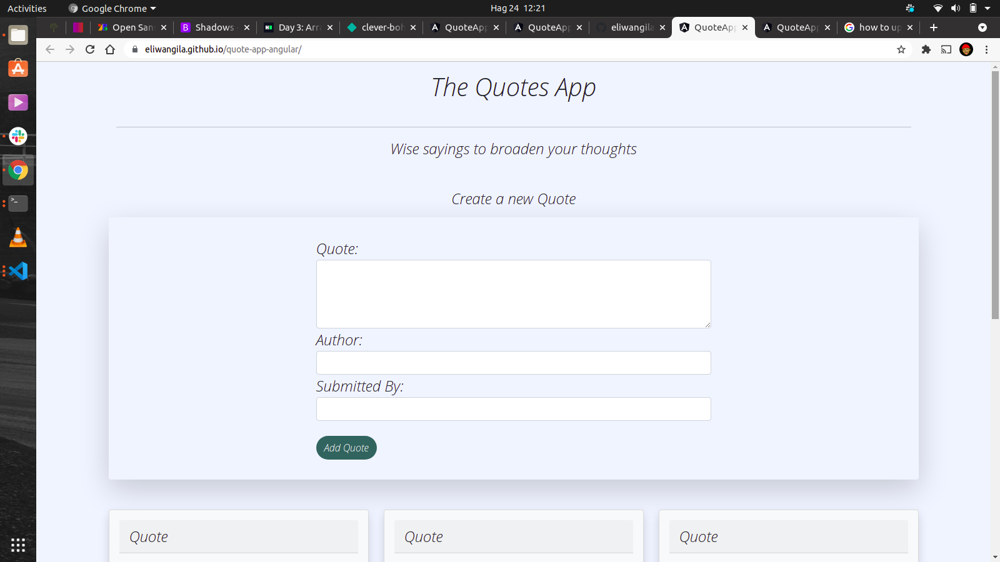
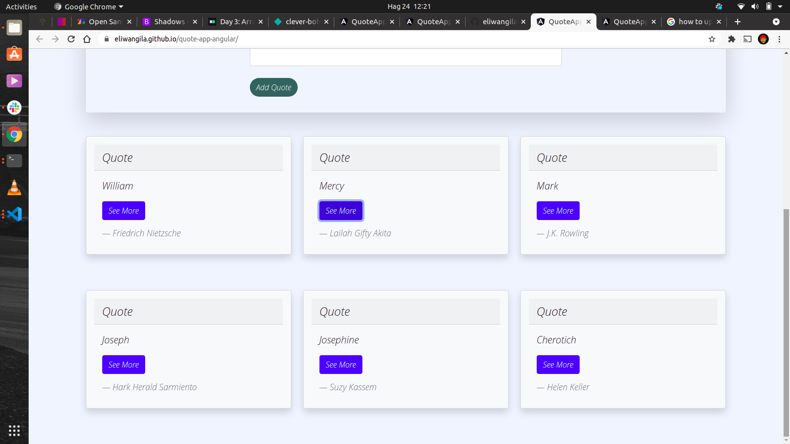

# QuoteApp

# Author
 Eli Wangila.

 # Description
This is an angularcli application that displays quotes, allows the user to input a new quote, like and dislike, it sorts the votes according to the highest votes of likes.

[livelink]()

# Screenshot

# Installtion/Setup instruction
* open terminal
* git clone the repo [link](https://github.com/eliwangila/quote-app-angular.git)
* cd Quote-App
code . to open on text editor

# Technologies Used
* HTML5
* CSS
* Bootstrap
* AngularCli

# Known Bugs
 * creating directives fills to work at some point 

# Contact information

For an questions nor concerns about the project please email me via [ekirapaeli254@gmail.com]

Lisence
* MIT lisence:
* Copyright (c) 2021 **Eli Wangila**
